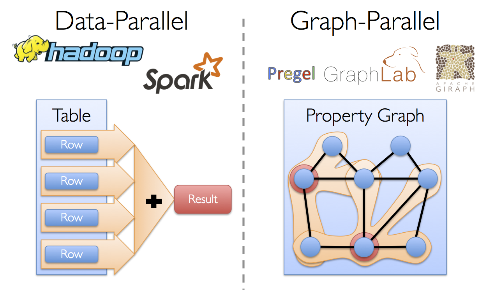
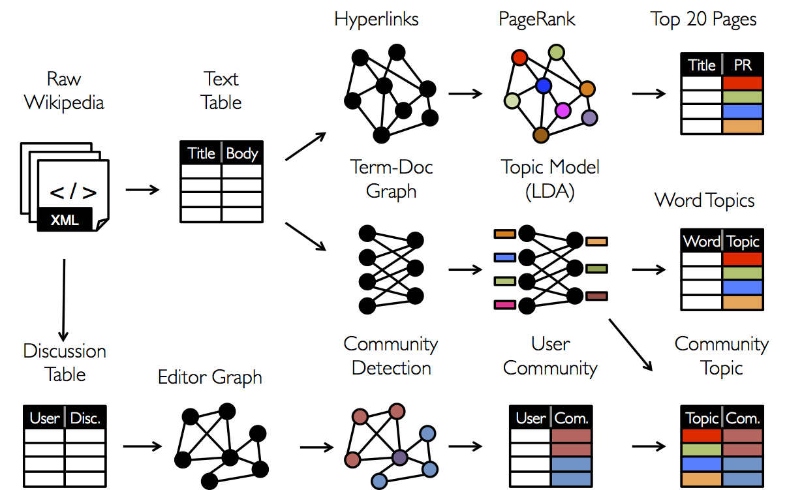

# GraphX编程指南

GraphX是一个新的（alpha）Spark API，它用于图和并行图(graph-parallel)的计算。GraphX通过引入[Resilient Distributed Property Graph](property-graph.md)：带有
顶点和边属性的有向多重图，来扩展Spark RDD。为了支持图计算，GraphX公开一组基本的功能操作以及Pregel API的一个优化。另外，GraphX包含了一个日益增长的图算法和图builders的
集合，用以简化图分析任务。

从社交网络到语言建模，不断增长的规模和图形数据的重要性已经推动了许多新的`graph-parallel`系统（如[Giraph](http://giraph.apache.org/)和[GraphLab](http://graphlab.org/)）的发展。
通过限制可表达的计算类型和引入新的技术来划分和分配图，这些系统可以高效地执行复杂的图形算法，比一般的`data-parallel`系统快很多。

然而，通过这种限制可以提高性能，但是很难表示典型的图分析途径（构造图、修改它的结构或者表示跨多个图的计算）中很多重要的stages。另外，我们如何看待数据取决于我们的目标，并且同一原始数据可能有许多不同表和图的视图。

结论是，图和表之间经常需要能够相互移动。然而，现有的图分析管道必须组成`graph-parallel`和`data- parallel`系统`，从而实现大数据的迁移和复制并生成一个复杂的编程模型。

GraphX项目的目的就是将`graph-parallel`和`data-parallel`统一到一个系统中，这个系统拥有一个唯一的组合API。GraphX允许用户将数据当做一个图和一个集合（RDD），而不需要
而不需要数据移动或者复杂。通过将最新的进展整合进`graph-parallel`系统，GraphX能够优化图操作的执行。

* [开始](getting-started.md)
* [属性图](property-graph.md)
* [图操作符](graph-operators.md)
* [Pregel API](pregel-api.md)
* [图构造者](graph-builders.md)
* [顶点和边RDDs](vertex-and-edge-rdds.md)
* [图算法](graph-algorithms.md)
* [例子](examples.md)