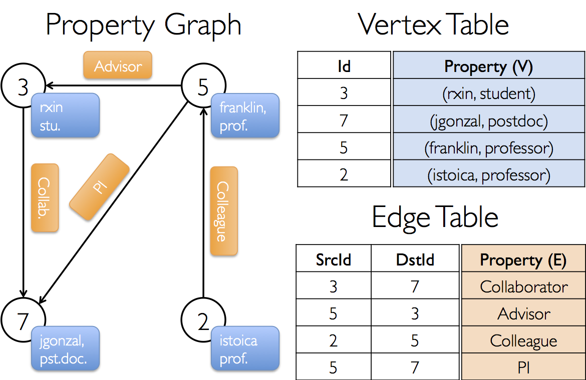

# 属性图

[属性图](https://spark.apache.org/docs/latest/api/scala/index.html#org.apache.spark.graphx.Graph)是一个有向多重图，它带有连接到每个顶点和边的用户定义的对象。
有向多重图中多个并行(parallel)的边共享相同的源和目的地顶点。支持并行边的能力简化了建模场景，这个场景中，相同的顶点存在多种关系(例如co-worker和friend)。每个顶点由一个
唯一的64位长的标识符（VertexID）作为key。GraphX并没有对顶点标识强加任何排序。同样，顶点拥有相应的源和目的顶点标识符。

属性图通过vertex(VD)和edge(ED)类型参数化，这些类型是分别与每个顶点和边相关联的对象的类型。

在某些情况下，在相同的图形中，可能希望顶点拥有不同的属性类型。这可以通过继承完成。例如，将用户和产品建模成一个二分图，我们可以用如下方式

```scala
class VertexProperty()
case class UserProperty(val name: String) extends VertexProperty
case class ProductProperty(val name: String, val price: Double) extends VertexProperty
// The graph might then have the type:
var graph: Graph[VertexProperty, String] = null
```
和RDD一样，属性图是不可变的、分布式的、容错的。图的值或者结构的改变需要按期望的生成一个新的图来实现。注意，原始图的大部分都可以在新图中重用，用来减少这种固有的功能数据结构的成本。
执行者使用一系列顶点分区试探法来对图进行分区。如RDD一样，图中的每个分区可以在发生故障的情况下被重新创建在不同的机器上。

逻辑上的属性图对应于一对类型化的集合(RDD),这个集合编码了每一个顶点和边的属性。因此，图类包含访问图中顶点和边的成员。

```scala
class Graph[VD, ED] {
  val vertices: VertexRDD[VD]
  val edges: EdgeRDD[ED]
}
```

`VertexRDD[VD]`和`EdgeRDD[ED]`类分别继承和优化自`RDD[(VertexID, VD)]`和`RDD[Edge[ED]]`。`VertexRDD[VD]`和`EdgeRDD[ED]`都支持额外的功能来建立在图计算和利用内部优化。

## 属性图的例子

在GraphX项目中，假设我们想构造一个包括不同合作者的属性图。顶点属性可能包含用户名和职业。我们可以用描述合作者之间关系的字符串标注边缘。



所得的图形将具有类型签名

```scala
val userGraph: Graph[(String, String), String]
```
有很多方式从一个原始文件、RDD构造一个属性图。最一般的方法是利用[Graph object](https://spark.apache.org/docs/latest/api/scala/index.html#org.apache.spark.graphx.Graph$)。
下面的代码从RDD集合生成属性图。

```scala
// Assume the SparkContext has already been constructed
val sc: SparkContext
// Create an RDD for the vertices
val users: RDD[(VertexId, (String, String))] =
  sc.parallelize(Array((3L, ("rxin", "student")), (7L, ("jgonzal", "postdoc")),
                       (5L, ("franklin", "prof")), (2L, ("istoica", "prof"))))
// Create an RDD for edges
val relationships: RDD[Edge[String]] =
  sc.parallelize(Array(Edge(3L, 7L, "collab"),    Edge(5L, 3L, "advisor"),
                       Edge(2L, 5L, "colleague"), Edge(5L, 7L, "pi")))
// Define a default user in case there are relationship with missing user
val defaultUser = ("John Doe", "Missing")
// Build the initial Graph
val graph = Graph(users, relationships, defaultUser)
```
在上面的例子中，我们用到了[Edge](https://spark.apache.org/docs/latest/api/scala/index.html#org.apache.spark.graphx.Edge)样本类。边有一个`srcId`和`dstId`分别对应
于源和目标顶点的标示符。另外，`Edge`类有一个`attr`成员用来存储边属性。

我们可以分别用`graph.vertices`和`graph.edges`成员将一个图解构为相应的顶点和边。

```scala
val graph: Graph[(String, String), String] // Constructed from above
// Count all users which are postdocs
graph.vertices.filter { case (id, (name, pos)) => pos == "postdoc" }.count
// Count all the edges where src > dst
graph.edges.filter(e => e.srcId > e.dstId).count
```

```
注意，graph.vertices返回一个VertexRDD[(String, String)]，它继承于 RDD[(VertexID, (String, String))]。所以我们可以用scala的case表达式解构这个元组。另一方面，
graph.edges返回一个包含Edge[String]对象的EdgeRDD。我们也可以用到case类的类型构造器，如下例所示。

graph.edges.filter { case Edge(src, dst, prop) => src > dst }.count
```

除了属性图的顶点和边视图，GraphX也包含了一个三元组视图，三元视图逻辑上将顶点和边的属性保存为一个`RDD[EdgeTriplet[VD, ED]]`，它包含[EdgeTriplet](https://spark.apache.org/docs/latest/api/scala/index.html#org.apache.spark.graphx.EdgeTriplet)类的实例。
可以通过下面的Sql表达式表示这个连接。
```sql
SELECT src.id, dst.id, src.attr, e.attr, dst.attr
FROM edges AS e LEFT JOIN vertices AS src, vertices AS dst
ON e.srcId = src.Id AND e.dstId = dst.Id
```

或者通过下面的图来表示。


`EdgeTriplet`类继承于`Edge`类，并且加入了`srcAttr`和`dstAttr`成员，这两个成员分别包含源和目的的属性。我们可以用一个三元组视图渲染字符串集合用来描述用户之间的关系。

```scala
val graph: Graph[(String, String), String] // Constructed from above
// Use the triplets view to create an RDD of facts.
val facts: RDD[String] =
  graph.triplets.map(triplet =>
    triplet.srcAttr._1 + " is the " + triplet.attr + " of " + triplet.dstAttr._1)
facts.collect.foreach(println(_))
```


