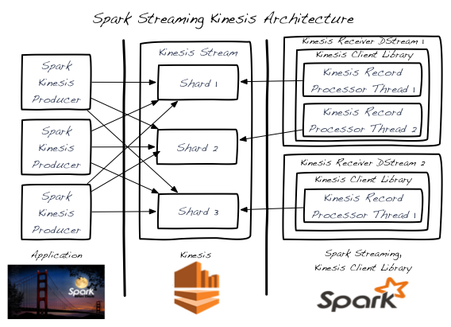

# Kinesis集成指南

亚马逊Kinesis是一个实时处理大规模流式数据的全托管服务。Kinesis receiver应用Kinesis客户端库（KCL）创建一个输入DStream。KCL由亚马逊提供，它拥有亚马逊软件许可证(ASL)。KCL构建在
apache 2.0许可的AWS java SDK之上，通过Workers、检查点(Checkpoints)和Shard Leases等概念提供了负载均衡、容错、检查点机制。下面将详细介绍怎样配置Spark Streaming从Kinesis获取
数据。

## 配置Kinesis

一个Kinesis流可以通用一个拥有一个或者多个shard的有效Kinesis端点(endpoint)来建立，详情请见[指南](http://docs.aws.amazon.com/kinesis/latest/dev/step-one-create-stream.html)

## 配置Spark Streaming应用程序

1、链接：在你的SBT或者Maven项目定义中，引用下面的组件到流应用程序中

```
 groupId = org.apache.spark
 artifactId = spark-streaming-kinesis-asl_2.10
 version = 1.1.1
```
需要注意的是，链接这个库，你必须将[ASL](https://aws.amazon.com/asl/)认证代码加入到你的应用程序中。

2、编程：在你的应用程序代码中，通过引入`KinesisUtils`创建DStream

```scala
 import org.apache.spark.streaming.Duration
 import org.apache.spark.streaming.kinesis._
 import com.amazonaws.services.kinesis.clientlibrary.lib.worker.InitialPositionInStream
 val kinesisStream = KinesisUtils.createStream(
 	streamingContext, [Kinesis stream name], [endpoint URL], [checkpoint interval], [initial position])
```

可以查看[API文档](https://spark.apache.org/docs/latest/api/scala/index.html#org.apache.spark.streaming.kinesis.KinesisUtils$)和[例子](https://github.com/apache/spark/tree/master/extras/kinesis-asl/src/main/scala/org/apache/spark/examples/streaming/KinesisWordCountASL.scala)。

  - streamingContext：streamingContext包含一个应用程序名称，这个名称关联Kinesis应用程序和Kinesis流。
  - Kinesis stream name：这个流应用程序的Kinesis流获取名称满足一下几点：
    - 在流上下文中使用的应用程序名称可以作为Kinesis应用程序名称
    - 对于某个地区的同一账户，应用程序名称必须唯一
    - Kinesis的后端通过一个DynamoDB表（一般情况下在us-east-1 region）自动的关联应用程序名称和Kinesis流，这个DynamoDB表由Kinesis流初始化
    - 在某些情况下，改变应用程序名称或者流名称可能导致Kinesis错误，如果你发现了错误，你可能需要手动删除DynamoDB表
  - endpoint URL：合法的Kinesis endpoint URL能够在[这里](http://docs.aws.amazon.com/general/latest/gr/rande.html#ak_region)找到。
  - checkpoint interval：KCL在流中保存检查点位置的时间间隔，对于初学者，可以将其和流应用程序的批时间间隔设置得一致。
  - initial position：可以是`InitialPositionInStream.TRIM_HORIZON`也可以是`InitialPositionInStream.LATEST`(可以查看Kinesis checkpoint和亚马逊Kinesis API文档了解详细信息)

3、部署：将`spark-streaming-kinesis-asl_2.10`和它的依赖（除了`spark-core_2.10`和`spark-streaming_2.10`）打包到应用程序的jar包中。然后用`spark-submit`方法启动你的应用程序。

在运行过程中需要注意一下几点:

  - Kinesis的每个分区的数据处理都是有序的，每一条消息至少出现一次
  - 多个应用程序可以从相同的Kinesis流读取数据，Kinesis将会保存特定程序的shard和checkpoint到DynamodDB中
  - 在某一时间单个的Kinesis流shard只能被一个输入DStream处理
  - 单个的Kinesis DStream通过创建多个`KinesisRecordProcessor`线程，可以从Kinesis流的多个shard中读取数据
  - 分开运行在不同的processes或者instances中的多个输入DStream能够从Kinesis流中读到
  - Kinesis输入DStream的数量不应比Kinesis shard的数量多，这是因为每个输入DStream都将创建至少一个`KinesisRecordProcessor`线程去处理单个的shard
  - 通过添加或者删除DStreams（在单个处理器或者多个processes/instance之间）可以获得水平扩展，直到扩展到Kinesis shard的数量。
  - Kinesis输入DStream将会平衡所有DStream的负载，甚至是跨processes/instance的DStream
  - Kinesis输入DStream将会平衡由于变化引起的re-shard事件（合并和切分）的负载
  - 作为一个最佳实践，建议避免使用过度的re-shard
  - 每一个Kinesis输入DStream都包含它们自己的checkpoint信息
  - Kinesis流shard的数量与RDD分区（在Spark输入DStream处理的过程中产生）的数量之间没有关系。它们是两种独立的分区模式



## 运行实例

- 下载Spark 源代码，然后按照下面的方法build Spark。
```
mvn -Pkinesis-asl -DskipTests clean package
```
- 在AWS中设定Kinesis流。注意Kinesis流的名字以及endpoint URL与流创建的地区相关联
- 在你的AWS证书中设定`AWS_ACCESS_KEY_ID`和`AWS_SECRET_KEY`环境变量
- 在Spark根目录下面，运行例子

```
bin/run-example streaming.KinesisWordCountASL [Kinesis stream name] [endpoint URL]
```
这个例子将会等待从Kinesis流中获取数据

- 在另外一个终端，为了生成生成随机的字符串数据到Kinesis流中，运行相关的Kinesis数据生产者
```
bin/run-example streaming.KinesisWordCountProducerASL [Kinesis stream name] [endpoint URL] 1000 10
```
这步将会每秒推送1000行，每行带有10个随机数字的数据到Kinesis流中，这些数据将会被运行的例子接收和处理

## Kinesis Checkpointing

- 每一个Kinesis输入DStream定期的存储流的当前位置到后台的DynamoDB表中。这允许系统从错误中恢复，继续执行DStream留下的任务。
- Checkpointing太频繁将会造成AWS检查点存储层过载，并且可能导致AWS节流(throttling)。提供的例子通过随机回退重试(random-backoff-retry)策略解决这个节流问题
- 当输入DStream启动时，如果没有Kinesis checkpoint信息存在。它将会从最老的可用的记录（InitialPositionInStream.TRIM_HORIZON）或者最近的记录（InitialPostitionInStream.LATEST）启动。
- 如果数据添加到流中的时候还没有输入DStream在运行，InitialPositionInStream.LATEST可能导致丢失记录。
- InitialPositionInStream.TRIM_HORIZON可能导致记录的重复处理，这个错误的影响依赖于checkpoint的频率以及处理的幂等性。
