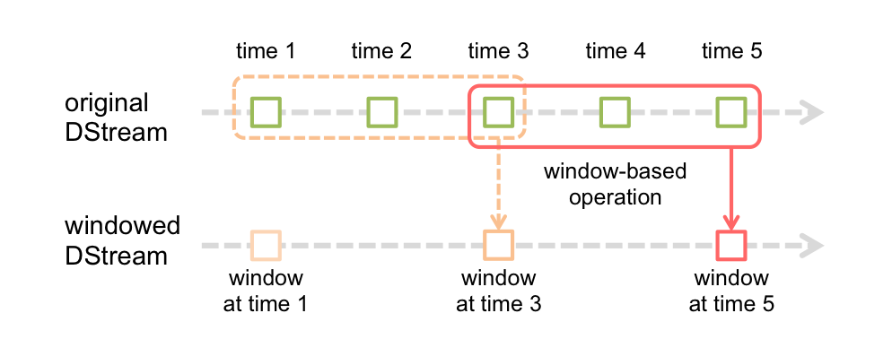

# DStream中的转换（transformation）

和RDD类似，transformation允许从输入DStream来的数据被修改。DStreams支持很多在RDD中可用的transformation算子。一些常用的算子如下所示：

Transformation | Meaning
--- | ---
map(func) | 利用函数`func`处理原DStream的每个元素，返回一个新的DStream
flatMap(func) | 与map相似，但是每个输入项可用被映射为0个或者多个输出项
filter(func) | 返回一个新的DStream，它仅仅包含源DStream中满足函数func的项
repartition(numPartitions) | 通过创建更多或者更少的partition改变这个DStream的并行级别(level of parallelism)
union(otherStream) | 返回一个新的DStream,它包含源DStream和otherStream的联合元素
count() | 通过计算源DStream中每个RDD的元素数量，返回一个包含单元素(single-element)RDDs的新DStream
reduce(func) | 利用函数func聚集源DStream中每个RDD的元素，返回一个包含单元素(single-element)RDDs的新DStream。函数应该是相关联的，以使计算可以并行化
countByValue() | 这个算子应用于元素类型为K的DStream上，返回一个（K,long）对的新DStream，每个键的值是在原DStream的每个RDD中的频率。
reduceByKey(func, [numTasks]) | 当在一个由(K,V)对组成的DStream上调用这个算子，返回一个新的由(K,V)对组成的DStream，每一个key的值均由给定的reduce函数聚集起来。注意：在默认情况下，这个算子利用了Spark默认的并发任务数去分组。你可以用`numTasks`参数设置不同的任务数
join(otherStream, [numTasks]) | 当应用于两个DStream（一个包含（K,V）对,一个包含(K,W)对），返回一个包含(K, (V, W))对的新DStream
cogroup(otherStream, [numTasks]) | 当应用于两个DStream（一个包含（K,V）对,一个包含(K,W)对），返回一个包含(K, Seq[V], Seq[W])的元组
transform(func) | 通过对源DStream的每个RDD应用RDD-to-RDD函数，创建一个新的DStream。这个可以在DStream中的任何RDD操作中使用
updateStateByKey(func) | 利用给定的函数更新DStream的状态，返回一个新"state"的DStream。

最后两个transformation算子需要重点介绍一下：

## UpdateStateByKey操作


updateStateByKey操作允许不断用新信息更新它的同时保持任意状态。你需要通过两步来使用它

- 定义状态-状态可以是任何的数据类型
- 定义状态更新函数-怎样利用更新前的状态和从输入流里面获取的新值更新状态

让我们举个例子说明。在例子中，你想保持一个文本数据流中每个单词的运行次数，运行次数用一个state表示，它的类型是整数

```scala
def updateFunction(newValues: Seq[Int], runningCount: Option[Int]): Option[Int] = {
    val newCount = ...  // add the new values with the previous running count to get the new count
    Some(newCount)
}
```

这个函数被用到了DStream包含的单词上

```scala
import org.apache.spark._
import org.apache.spark.streaming._
import org.apache.spark.streaming.StreamingContext._
// Create a local StreamingContext with two working thread and batch interval of 1 second
val conf = new SparkConf().setMaster("local[2]").setAppName("NetworkWordCount")
val ssc = new StreamingContext(conf, Seconds(1))
// Create a DStream that will connect to hostname:port, like localhost:9999
val lines = ssc.socketTextStream("localhost", 9999)
// Split each line into words
val words = lines.flatMap(_.split(" "))
// Count each word in each batch
val pairs = words.map(word => (word, 1))
val runningCounts = pairs.updateStateByKey[Int](updateFunction _)
```

更新函数将会被每个单词调用，`newValues`拥有一系列的1（从 (词, 1)对而来），runningCount拥有之前的次数。要看完整的代码，见[例子](https://github.com/apache/spark/blob/master/examples/src/main/scala/org/apache/spark/examples/streaming/StatefulNetworkWordCount.scala)

## Transform操作

`transform`操作（以及它的变化形式如`transformWith`）允许在DStream运行任何RDD-to-RDD函数。它能够被用来应用任何没在DStream API中提供的RDD操作（It can be used to apply any RDD operation that is not exposed in the DStream API）。
例如，连接数据流中的每个批（batch）和另外一个数据集的功能并没有在DStream API中提供，然而你可以简单的利用`transform`方法做到。如果你想通过连接带有预先计算的垃圾邮件信息的输入数据流
来清理实时数据，然后过了它们，你可以按如下方法来做：

```scala
val spamInfoRDD = ssc.sparkContext.newAPIHadoopRDD(...) // RDD containing spam information

val cleanedDStream = wordCounts.transform(rdd => {
  rdd.join(spamInfoRDD).filter(...) // join data stream with spam information to do data cleaning
  ...
})
```

事实上，你也可以在`transform`方法中用[机器学习](https://spark.apache.org/docs/latest/mllib-guide.html)和[图计算](https://spark.apache.org/docs/latest/graphx-programming-guide.html)算法

## 窗口(window)操作

Spark Streaming也支持窗口计算，它允许你在一个滑动窗口数据上应用transformation算子。下图阐明了这个滑动窗口。



如上图显示，窗口在源DStream上滑动，合并和操作落入窗内的源RDDs，产生窗口化的DStream的RDDs。在这个具体的例子中，程序在三个时间单元的数据上进行窗口操作，并且每两个时间单元滑动一次。
这说明，任何一个窗口操作都需要指定两个参数：

- 窗口长度：窗口的持续时间
- 滑动的时间间隔：窗口操作执行的时间间隔

这两个参数必须是源DStream的批时间间隔的倍数。

下面举例说明窗口操作。例如，你想扩展前面的[例子](../a-quick-example.md)用来计算过去30秒的词频，间隔时间是10秒。为了达到这个目的，我们必须在过去30秒的`pairs` DStream上应用`reduceByKey`
操作。用方法`reduceByKeyAndWindow`实现。

```scala
// Reduce last 30 seconds of data, every 10 seconds
val windowedWordCounts = pairs.reduceByKeyAndWindow((a:Int,b:Int) => (a + b), Seconds(30), Seconds(10))
```

一些常用的窗口操作如下所示，这些操作都需要用到上文提到的两个参数：窗口长度和滑动的时间间隔

Transformation | Meaning
--- | ---
window(windowLength, slideInterval) | 基于源DStream产生的窗口化的批数据计算一个新的DStream
countByWindow(windowLength, slideInterval) | 返回流中元素的一个滑动窗口数
reduceByWindow(func, windowLength, slideInterval) | 返回一个单元素流。利用函数func聚集滑动时间间隔的流的元素创建这个单元素流。函数必须是相关联的以使计算能够正确的并行计算。
reduceByKeyAndWindow(func, windowLength, slideInterval, [numTasks]) | 应用到一个(K,V)对组成的DStream上，返回一个由(K,V)对组成的新的DStream。每一个key的值均由给定的reduce函数聚集起来。注意：在默认情况下，这个算子利用了Spark默认的并发任务数去分组。你可以用`numTasks`参数设置不同的任务数
reduceByKeyAndWindow(func, invFunc, windowLength, slideInterval, [numTasks]) | A more efficient version of the above reduceByKeyAndWindow() where the reduce value of each window is calculated incrementally using the reduce values of the previous window. This is done by reducing the new data that enter the sliding window, and "inverse reducing" the old data that leave the window. An example would be that of "adding" and "subtracting" counts of keys as the window slides. However, it is applicable to only "invertible reduce functions", that is, those reduce functions which have a corresponding "inverse reduce" function (taken as parameter invFunc. Like in reduceByKeyAndWindow, the number of reduce tasks is configurable through an optional argument.
countByValueAndWindow(windowLength, slideInterval, [numTasks]) | 应用到一个(K,V)对组成的DStream上，返回一个由(K,V)对组成的新的DStream。每个key的值都是它们在滑动窗口中出现的频率。